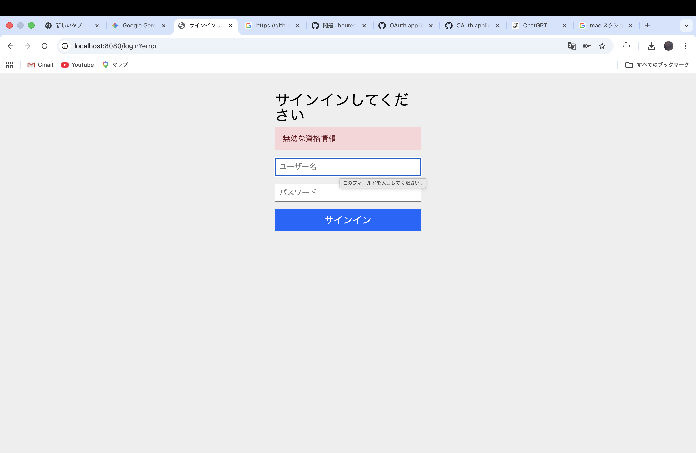
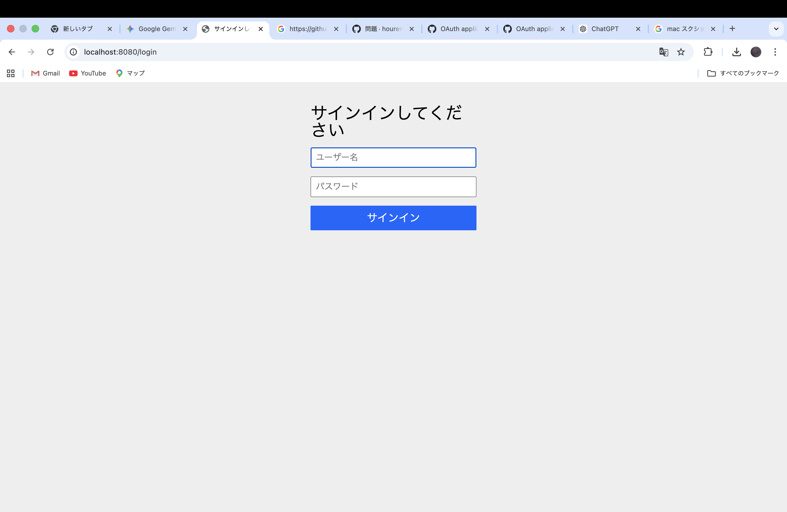
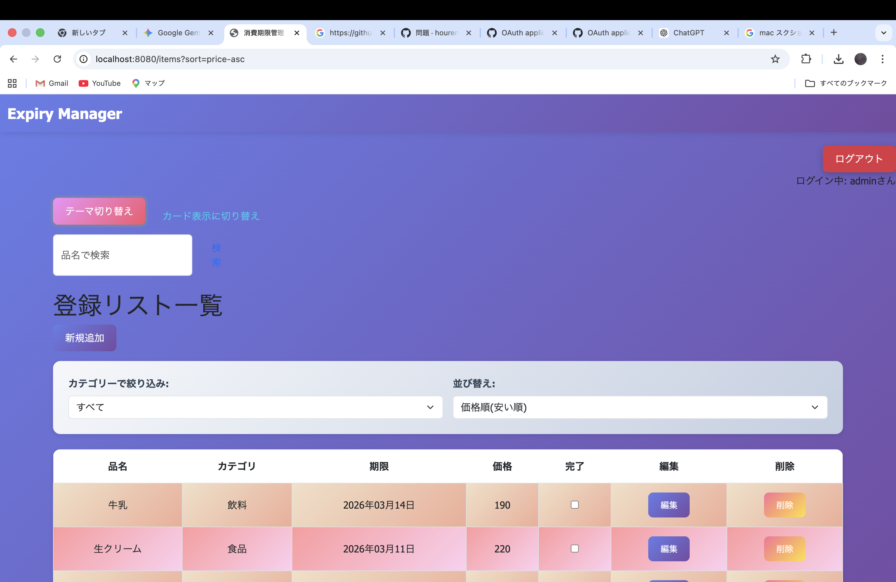

# Expiry Manager（消費期限管理アプリ）

初めて開発した、JavaとSpringBootによるログイン機能付きの期限管理アプリケーションです。「誰でも直感的に使え、かつセキュリティが守られていること」を意識して作成しました。

## 主な機能
- **ユーザー認証**: SpringSecurityによるセッション管理（ログイン・ログアウト）。
- **パスワード暗号化**: Bcryptを用いたハッシュ化保存によるセキュリティ強化
- **アイテム管理**: ユーザーごとのアイテム登録・一覧表示機能
- **エラーハンドリング**: 不正なログイン思考へのエラーメッセージ表示

##　こだわり・学習したポイント
- **保守性の高い設計**: `Controller`, `Service`, `Repository`, `Model` の４層に分ける（MVCモデル）ことで、後からの修正や機能追加がしやすい構造にしました
- **独自認証の実装**: Spring標準の認証をそのまま使うのではなく、 `UserDetailsService`　を独自にカスタマイズし、自作のデータベースと連携させる仕組みを理解して実装しました
- **セキュリティの意識**: 初めてのアプリ制作ながら、ユーザーの個人情報を守るためにパスワードのハッシュかは必須と考え、実装に取り入れました

## 動作画面

### ログイン画面

### メイン画面

